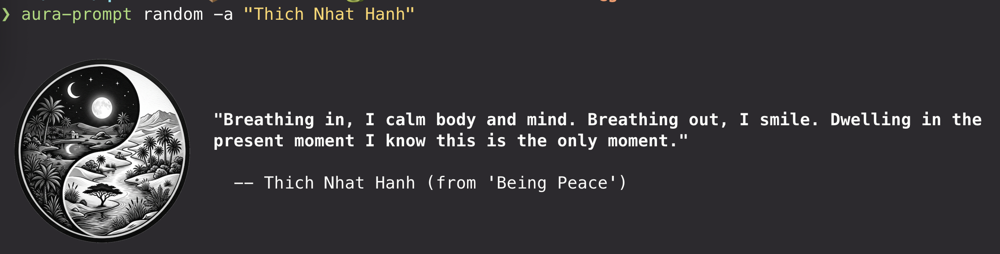

# Zen Prompt

Aesthetic inspiration for your shell.



## Features

- **Shell Inspiration First**: Instantly generate aesthetic quote prompts with `zen-prompt random`, using quotes collected from Goodreads and optional photo layouts for a more atmospheric terminal experience.
- **Resumable Crawling**: Collect more quotes from Goodreads over time and resume from the last processed page for each tag.
- **Quote Statistics**: Explore the collection later with database statistics and exports once your cache grows.


## Tech Stack

- **Python 3.13+**
- **[uv](https://github.com/astral-sh/uv)**: Dependency management and project isolation.
- **Scrapy**: High-level crawling and scraping.
- **SQLite**: Local persistence and state management.
- **Typer**: CLI command parsing.
- **textual-image**: Terminal image rendering for photo-backed quote output.
- **Pydantic**: Data validation.

## Setup

Install the package directly from PyPI (or your internal index):

```bash
pip install zen-prompt
```

This will install the `zen-prompt` command-line tool globally (or in your virtual environment).


## Usage

After installation, you can use the `zen-prompt` command directly.

### Random Inspiration

Start with the main experience: generate quotes collected from Goodreads directly in your shell.

Tip: add `zen-prompt random` to your shell startup file so each new terminal session opens with a fresh quote.

```bash
# zsh
echo 'zen-prompt random' >> ~/.zshrc

# bash
echo 'zen-prompt random' >> ~/.bashrc
```

```bash
# Get a random quote with the default monochrome photo
zen-prompt random

# Disable the default photo
zen-prompt random --no-photo

# Pick only shorter quotes
zen-prompt random --quote-max-words 20 --quote-max-chars 140

# Pick a random hero photo from a topic
zen-prompt random --photo topic@monochrome

# Control image size in the terminal
zen-prompt random --photo topic@monochrome --photo-max-height 10 --photo-max-width 80

# Render photo and quote side by side
zen-prompt random --photo topic@monochrome --photo-layout table

# Wrap long quotes to a fixed width
zen-prompt random --quote-width 60

# Reuse a fixed image for every quote
zen-prompt random --photo file@./cover.png
```

### Crawling Later

Start crawling quotes for specific tags. The default tags are `inspirational,motivational,buddhism`.

```bash
# Basic crawl
zen-prompt crawl --tags inspirational,life

# Crawl from a specific Goodreads URL (author, book, etc.)
zen-prompt crawl --url https://www.goodreads.com/author/zen-prompt/123.Author_Name

# Configurable download delay (default 1s)
zen-prompt crawl --download-delay 2.0
```

The crawler will save quotes to `docs/data/sqlite/quotes.db` by default and display real-time progress.

### Quote Statistics Later

Once you have a local cache, inspect the quote database with summary statistics.

```bash
# Print statistics in the terminal
zen-prompt stat

# Save statistics as Markdown
zen-prompt stat --output stats.md
```

### Exporting

Export your collection as optimized web and CLI assets.

```bash
# Export optimized SQLite and JSON files to ./docs
zen-prompt export --output-dir ./docs --small-limit 500
```

This command creates:
- `docs/data/sqlite/quotes.db`: Complete optimized database with FTS5 search.
- `docs/data/sqlite/quotes-small.db`: Small subset (tag: buddhism) for instant availability.
- `docs/data/json/quotes.json` & `docs/data/json/quotes-small.json`: JSON versions of the databases.
- `docs/data/csv/quotes.csv` & `docs/data/csv/quotes-small.csv`: CSV versions of the databases.

### Sync and Search

```bash
# Sync data files (SQLite, CSV, JSON) from the remote static website
zen-prompt sync https://anhldbk.github.io/zen-prompt/data/

# Lightning-fast keyword search using FTS5
zen-prompt search "success and happiness" --limit 3
```

## Testing

Run the full suite of unit and integration tests:

```bash
export PYTHONPATH=$PYTHONPATH:. 
uv run pytest
```

## Project Structure

- `zen-prompt/`: Core package containing models, spider, database logic, and pipelines.
- `scripts/`: Entry point bash scripts.
- `docs/`: Design documents, implementation plans, and exported web assets (`docs/data/`).
- `tests/`: Comprehensive test suite.

---

Vibe coded via **Codex**.
